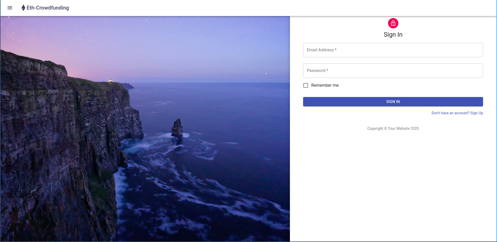
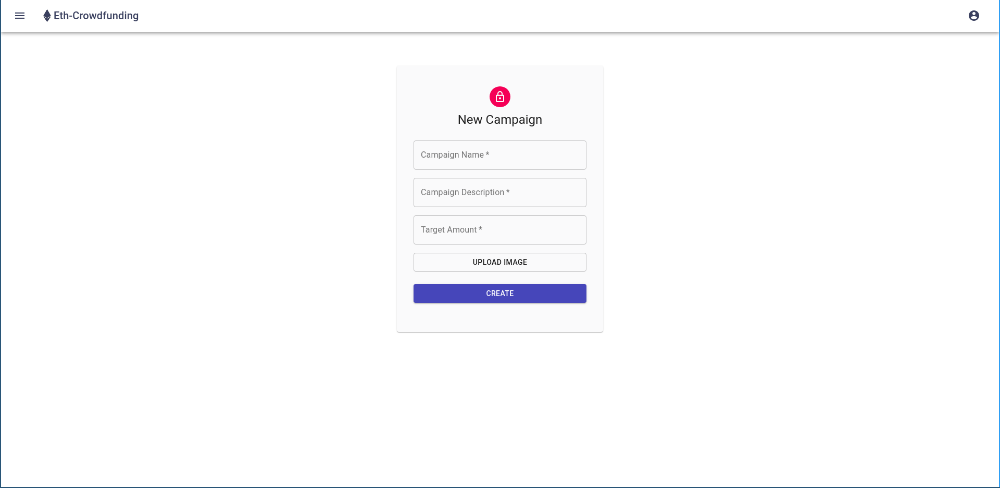

# Ethereum Based Crowdfunding

A Crowdfunding applicationion based on Ethereum.

## Screenshots

## Software Requirements

- [Ethereum](https://ethereum.org/) - It is a decentralized open source blockchain featuring smart contract functionality
- [Web3.js](https://web3js.readthedocs.io/) - It is a collection of libraries that allow you to interact with a local or remote ethereum node using HTTP, IPC or WebSocket
- [Node.js](https://nodejs.org/) - It is an open-source, cross-platform, JavaScript runtime environment
- [React](https://reactjs.org/) - It is an open-source JavaScript library for building user interfaces
- [Metamask](http://www.metamask.io/) - A crypto wallet & gateway to blockchain apps
- [Ganache](https://www.trufflesuite.com/ganache) - It is a personal blockchain for rapid Ethereum distributed application development
